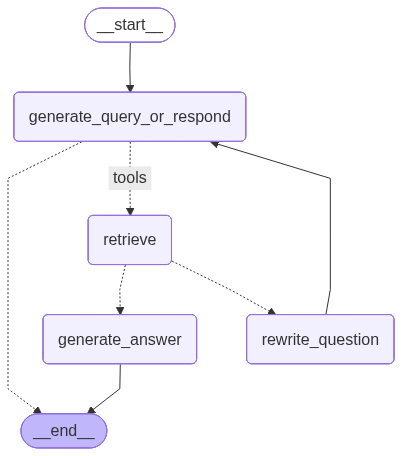

# Milvus RAG 工具集

基于 **LangChain + Milvus + Ollama** 实现的企业级 RAG 解决方案。

**技术栈**：

- 🦜 **LangChain**：RAG 工作流编排框架
- 🔄 **LangGraph**：构建状态图实现智能工作流
- 🗄️ **Milvus**：高性能向量数据库
- 🤖 **Ollama**：本地部署的文本嵌入模型 + 云端大语言模型

## ✨ 核心亮点

本项目不仅仅是简单的向量检索工具，而是基于 **LangGraph** 构建的**完整 RAG 智能工作流**：

- 🔍 **智能检索**：基于语义相似度的向量检索
- 📊 **质量评估**：自动评估检索结果的相关性（Grading）
- ✍️ **查询重写**：自动优化查询以提高检索效果（Query Rewriting）
- 🤖 **答案生成**：结合上下文生成高质量答案
- 🔄 **状态管理**：使用 LangGraph 状态图管理复杂工作流
- 🛠️ **工具集成**：将检索器集成为 LangChain 工具

**完整流程**：

```
用户查询 → 检索相关文档 → 评估相关性
         ↓ (相关性不足)      ↓ (相关)
    重写查询并重新检索 → 生成最终答案
```



---

## 📋 环境准备

在使用本项目之前，请确保已安装以下服务：

### 1. Milvus 向量数据库

**安装方式**（推荐使用 Docker）：

```bash
# 使用 Docker Compose 一键安装
wget https://github.com/milvus-io/milvus/releases/download/v2.3.3/milvus-standalone-docker-compose.yml -O docker-compose.yml
docker-compose up -d

# 验证安装
docker ps | grep milvus
```

**官方文档**：

- 📖 安装指南：https://milvus.io/docs/install_standalone-docker.md
- 🏠 官方网站：https://milvus.io/

**默认配置**：

- 端口：19530
- 地址：127.0.0.1

### 2. Ollama 模型服务

**安装方式**：

```bash
# macOS / Linux
curl -fsSL https://ollama.com/install.sh | sh

# Windows
# 访问官网下载安装包
```

**拉取所需模型**：

```bash
# 文本嵌入模型（必需，本地运行）
ollama pull qwen3-embedding:4b

# 大语言模型（可选，用于本地测试）
ollama pull qwen2.5:7b
# 或其他模型如：llama3.1, mistral 等
```

**验证安装**：

```bash
# 检查服务状态
curl http://localhost:11434/api/tags

# 查看已安装的模型
ollama list
```

**官方文档**：

- 📖 安装指南：https://ollama.com/download
- 🏠 官方网站：https://ollama.com/
- 📚 模型库：https://ollama.com/library

**默认配置**：

- 端口：11434
- 地址：http://localhost:11434

**注意**：本项目默认使用 Ollama 的云端 API (https://ollama.com) 运行大语言模型，需要设置环境变量 `OLLAMA_API_KEY`。

---

## 🚀 快速开始

### 安装依赖

```bash
pip install -r requirements.txt
```

### 运行示例

```python
from milvusRAG.index import RAGBuilder

# 1. 创建 RAG 构建器
builder = RAGBuilder()

# 2. 构建 RAG 索引
milvus = builder.build_rag_index(
    data_dir="./data",              # 文档目录
    db_name="rag_database",         # 数据库名
    collection_name="my_documents", # 集合名
    chunk_size=500,                 # 分块大小
    chunk_overlap=50,               # 重叠大小
    drop_old=False,                 # 是否重建索引
    verbose=True
)

# 3. 创建 RAG 工作流图
query = "如何使用无头模式运行？"
graph = milvus.similarity_search(query, k=3)

# 4. 流式输出结果
for chunk in graph.stream({
    "messages": [{"role": "user", "content": query}]
}):
    for node, update in chunk.items():
        print(f"节点: {node}")
        update["messages"][-1].pretty_print()

# 5. 关闭连接
milvus.close()
```

或直接运行示例代码：

```bash
python main.py
```

---

## 📁 项目结构

```
rag_langchain_milvus/
├── milvusRAG/
│   ├── milvus_util.py      # 核心工具类（向量存储 + RAG工作流）
│   └── index.py            # RAG索引构建器
├── data/                   # 示例数据目录
├── main.py                 # 主程序入口
├── requirements.txt        # 项目依赖
├── README.md               # 项目文档
├── USAGE_GUIDE.md          # 详细使用指南
└── workflow_graph.png      # 工作流可视化图
```

---

## 📦 核心模块

### 1. `milvus_util.py` - 核心工具类

封装了 Milvus 向量数据库操作和完整的 RAG 工作流。

**主要功能：**

- 🔌 **数据库管理**：连接、数据库创建、集合管理
- 🧠 **模型初始化**：Embedding 模型和 LLM 模型
- 📦 **向量存储**：文档向量化和存储
- 📝 **文档操作**：批量添加、元数据管理
- 🔍 **搜索功能**：相似度搜索、MMR 搜索
- 🔄 **RAG 工作流**：基于 LangGraph 的智能工作流
  - 文档检索（Retrieval）
  - 相关性评估（Grading）
  - 查询重写（Rewriting）
  - 答案生成（Generation）

**快速开始：**

```python
from milvusRAG.milvus_util import MilvusUtil

# 初始化
milvus = MilvusUtil(
    db_name="my_rag_db",
    collection_name="documents",
    verbose=True
)

# 一键初始化（连接、数据库、embedding、向量存储）
milvus.initialize()

# 添加文档
from langchain.schema import Document
documents = [
    Document(page_content="文档内容1", metadata={"source": "doc1.txt"}),
    Document(page_content="文档内容2", metadata={"source": "doc2.txt"}),
]
milvus.add_documents(documents)

# 创建 RAG 工作流并执行查询
graph = milvus.similarity_search("查询问题", k=3)
result = graph.invoke({"messages": [{"role": "user", "content": "你的问题"}]})

# 关闭连接
milvus.close()
```

### 2. `index.py` - RAG 索引构建模块

提供完整的文档加载、分割、向量化和索引构建流程。

**支持的文档格式：**

- 📄 PDF (.pdf)
- 📝 Markdown (.md)
- 📃 Text (.txt, .log)
- 📊 CSV (.csv)
- 🗂️ JSON (.json)
- 🌐 HTML (.html, .htm)
- 📑 Word (.docx, .doc)

**使用示例：**

```python
from milvusRAG.index import RAGBuilder

# 创建构建器
builder = RAGBuilder()

# 构建完整的 RAG 索引
milvus = builder.build_rag_index(
    data_dir="./data",              # 文档目录
    db_name="rag_database",         # 数据库名
    collection_name="my_docs",      # 集合名
    chunk_size=500,                 # 分块大小
    chunk_overlap=50,               # 重叠大小
    drop_old=True,                  # 是否重建
    verbose=True
)

# 使用构建好的索引进行搜索
if milvus:
    graph = milvus.similarity_search("查询问题", k=3)
    result = graph.invoke({"messages": [{"role": "user", "content": "问题"}]})
    milvus.close()
```

---

## 🔧 API 文档

### MilvusUtil 类

#### 初始化参数

| 参数                 | 类型 | 默认值                   | 说明                       |
| -------------------- | ---- | ------------------------ | -------------------------- |
| `host`               | str  | "127.0.0.1"              | Milvus 服务器地址          |
| `port`               | int  | 19530                    | Milvus 服务器端口          |
| `db_name`            | str  | "milvus_demo"            | 数据库名称                 |
| `embedding_model`    | str  | "qwen3-embedding:4b"     | Embedding 模型             |
| `embedding_base_url` | str  | "http://localhost:11434" | Embedding 服务地址（本地） |
| `llm_model`          | str  | "deepseek-v3.1:671b"     | 大语言模型                 |
| `llm_base_url`       | str  | "https://ollama.com"     | LLM 服务地址（云端）       |
| `collection_name`    | str  | None                     | 集合名称（可选）           |
| `drop_old`           | bool | False                    | 是否删除已存在的集合       |
| `verbose`            | bool | False                    | 是否显示详细日志           |

#### 主要方法

**连接与初始化**

```python
# 单步初始化
milvus.connect()              # 连接数据库
milvus.setup_database()       # 设置数据库
milvus.init_embeddings()      # 初始化embedding
milvus.init_response_model()  # 初始化LLM
milvus.create_vector_store()  # 创建向量存储

# 或一键初始化
milvus.initialize()           # 执行上述所有步骤
```

**文档操作**

```python
# 方式1: 添加 Document 对象（推荐）
from langchain.schema import Document
documents = [
    Document(page_content="内容", metadata={"source": "doc.txt"})
]
milvus.add_documents(documents)

# 方式2: 添加纯文本
milvus.add_texts(
    texts=["文本1", "文本2"],
    metadatas=[{"source": "doc1"}, {"source": "doc2"}]
)
```

**RAG 工作流**

```python
# 创建工作流图（自动完成检索、评估、重写、生成）
graph = milvus.similarity_search(
    query="查询内容",
    k=3,                        # 检索文档数量
    grade=True,                 # 是否启用相关性评估
    rewrite=True,               # 是否启用查询重写
    visualize=True,             # 是否生成可视化图
    graph_path="./workflow.png" # 可视化图保存路径
)

# 执行查询
result = graph.invoke({
    "messages": [{"role": "user", "content": "你的问题"}]
})

# 或流式输出
for chunk in graph.stream({
    "messages": [{"role": "user", "content": "你的问题"}]
}):
    for node, update in chunk.items():
        print(f"节点: {node}")
        update["messages"][-1].pretty_print()
```

**传统搜索**

```python
# 相似度搜索
results = milvus.search_similarity(
    query="查询内容",
    k=3,                           # 返回top-k结果
    filter={"source": "doc1"}      # 可选的元数据过滤
)

# MMR 搜索（更多样化的结果）
results = milvus.search_mmr(
    query="查询内容",
    k=3,                           # 最终返回数量
    fetch_k=20,                    # 候选数量
    lambda_mult=0.5                # 多样性参数(0-1)
)
```

**集合管理**

```python
# 获取集合信息
info = milvus.get_collection_info()
print(info)  # {"name": "...", "vector_dim": 768, ...}

# 删除集合
milvus.drop_collection("collection_name")

# 列出所有集合
collections = milvus.list_collections()
```

**关闭连接**

```python
milvus.close()
```

### RAGBuilder 类

#### 主要方法

```python
# 构建 RAG 索引
milvus = builder.build_rag_index(
    data_dir="./data",              # 文档目录（必需）
    db_name="rag_database",         # 数据库名（可选）
    collection_name="documents",    # 集合名（可选）
    chunk_size=500,                 # 分块大小（可选）
    chunk_overlap=50,               # 重叠大小（可选）
    drop_old=False,                 # 是否重建（可选）
    verbose=True                    # 详细日志（可选）
)

# 加载单个文件
documents = builder.load_single_file("path/to/file.pdf")

# 加载目录
documents = builder.smart_directory_loader("./data")

# 分割文档
splits = builder.split_documents(
    documents,
    chunk_size=500,
    chunk_overlap=50
)
```

---

## ⚙️ 配置说明

### 索引参数（HNSW）

```python
index_params = {
    "index_type": "HNSW",        # 索引类型
    "metric_type": "L2",         # 距离度量（L2或IP）
    "params": {
        "M": 16,                 # 连接数(10-32)，越大精度越高
        "efConstruction": 200,   # 构建参数(100-300)
    }
}
```

### 搜索参数

```python
search_params = {
    "metric_type": "L2",
    "params": {
        "ef": 64                 # 搜索范围(40-128)，越大精度越高
    }
}
```

### 环境变量

```bash
# Ollama API Key（使用云端 LLM 时必需）
export OLLAMA_API_KEY="your_api_key_here"
```

---

## 📊 工作流详解

### RAG 工作流状态图

本项目使用 **LangGraph** 构建智能 RAG 工作流，包含以下节点：

1. **agent**：接收用户查询，调用检索工具
2. **retrieve**：执行文档检索
3. **grade_documents**：评估检索文档的相关性
4. **rewrite**：重写查询以提高检索效果
5. **generate**：基于相关文档生成答案

**工作流程**：

```
START → agent → tools (retrieve) → grade_documents
                                         ↓
                                    (相关性不足)
                                         ↓
                                    rewrite → agent
                                         ↓
                                      (相关)
                                         ↓
                                    generate → END
```

### 可视化工作流

运行程序时会自动生成工作流可视化图：

```python
graph = milvus.similarity_search(
    query="问题",
    k=3,
    visualize=True,                # 启用可视化
    graph_path="./workflow_graph.png"
)
```

---

## 💡 使用场景

### 场景 1：知识库问答

```python
from milvusRAG.index import RAGBuilder

# 构建知识库索引
builder = RAGBuilder()
milvus = builder.build_rag_index(
    data_dir="./docs",
    db_name="knowledge_base",
    collection_name="company_docs"
)

# 智能问答
graph = milvus.similarity_search("公司的休假政策是什么？", k=5)
result = graph.invoke({"messages": [{"role": "user", "content": "公司的休假政策是什么？"}]})
print(result["messages"][-1].content)
```

### 场景 2：文档检索

```python
# 使用传统搜索（无 LLM 生成）
results = milvus.search_similarity(
    query="机器学习算法",
    k=10,
    filter={"category": "AI"}
)

for doc in results:
    print(f"相关文档: {doc.metadata['source']}")
    print(f"内容片段: {doc.page_content[:200]}")
```

### 场景 3：多样化推荐

```python
# 使用 MMR 搜索获取多样化结果
results = milvus.search_mmr(
    query="Python 编程教程",
    k=5,
    fetch_k=20,
    lambda_mult=0.7  # 提高多样性
)
```

---

## 🎯 性能优化建议

### 索引参数调优

- **高精度场景**：增大 M (如 32) 和 efConstruction (如 300)
- **高性能场景**：减小 M (如 8) 和 efConstruction (如 100)
- **平衡场景**：M=16, efConstruction=200（默认）

### 搜索参数调优

- **高召回率**：增大 ef (如 128)
- **快速搜索**：减小 ef (如 32)
- **平衡**：ef=64（默认）

### 文档分块建议

- **短文档**：chunk_size=200-300
- **中等文档**：chunk_size=500-800
- **长文档**：chunk_size=1000-1500
- **重叠比例**：一般为 chunk_size 的 10%-20%

### RAG 工作流优化

- **提高准确性**：启用 grade=True 和 rewrite=True
- **提高速度**：禁用评估和重写，直接生成答案
- **调整检索数量**：根据文档质量调整 k 值（3-10）

---

## 🔍 故障排除

### 连接失败

```bash
# 检查 Milvus 服务状态
docker ps | grep milvus

# 检查端口是否开放
telnet 127.0.0.1 19530

# 查看 Milvus 日志
docker logs milvus-standalone
```

### Embedding 失败

```bash
# 检查 Ollama 服务
curl http://localhost:11434/api/tags

# 拉取模型
ollama pull qwen3-embedding:4b

# 查看已安装的模型
ollama list
```

### LLM 调用失败

```bash
# 检查环境变量
echo $OLLAMA_API_KEY

# 设置 API Key
export OLLAMA_API_KEY="your_key"

# 测试云端 API
curl https://ollama.com/api/tags \
  -H "Authorization: Bearer $OLLAMA_API_KEY"
```

### 搜索无结果

1. 确认文档已成功添加：`milvus.get_collection_info()`
2. 检查集合是否为空：`info['is_empty']`
3. 尝试使用不同的查询文本
4. 检查元数据过滤条件是否过于严格

### 工作流执行失败

1. 检查 LLM 是否正确初始化
2. 确认 API Key 是否有效
3. 查看详细错误日志（设置 `verbose=True`）
4. 尝试禁用 grade 或 rewrite 功能

---

## 📚 更多资源

- **详细使用指南**：查看 [USAGE_GUIDE.md](./USAGE_GUIDE.md)
- **示例代码**：查看 [main.py](./main.py)
- **LangChain 文档**：https://python.langchain.com/
- **LangGraph 文档**：https://langchain-ai.github.io/langgraph/
- **Milvus 文档**：https://milvus.io/docs
- **Ollama 文档**：https://ollama.com/

---

## 📋 依赖要求

```bash
pip install langchain-milvus
pip install langchain-ollama
pip install pymilvus
pip install langchain-community
pip install langchain-text-splitters
pip install langgraph
pip install langchain-classic
```

或直接安装：

```bash
pip install -r requirements.txt
```

---

## 📝 注意事项

1. **Milvus 服务** - 确保 Milvus 服务已启动（默认端口 19530）
2. **Ollama 服务** - 确保 Ollama 服务已启动（默认端口 11434）
3. **Embedding 模型** - 确保已下载所需的 embedding 模型（如 qwen3-embedding:4b）
4. **API Key** - 使用云端 LLM 时需要设置 `OLLAMA_API_KEY` 环境变量
5. **集合管理** - 设置`drop_old=True`会删除已有集合，请谨慎使用
6. **日志输出** - 设置`verbose=True`可查看详细执行过程
7. **内存占用** - 大规模文档索引时注意内存使用情况

---

## 🤝 贡献

欢迎提交 Issue 和 Pull Request！

---

## 📄 License

MIT
